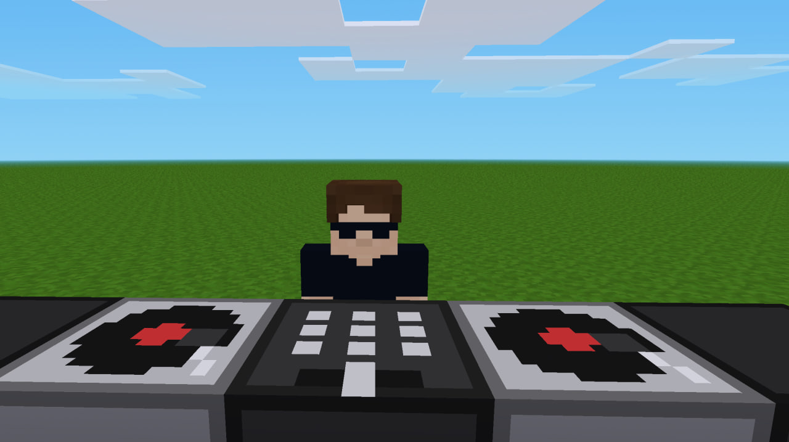
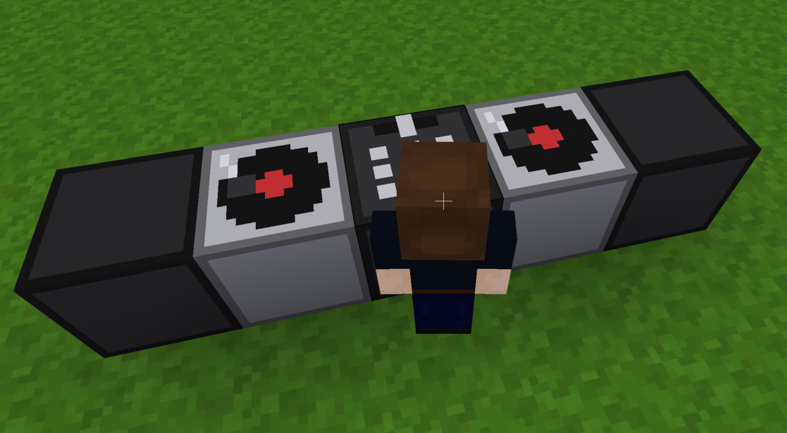

# 🎵 DJ Deck for Luanti/Minetest

**Drop the beat in your blocky world!** 🎧🎹

Transform your Luanti/Minetest server into a vibrant music venue with the **DJ Deck** mod. Place it down, interact with it, and bring your virtual parties to life with authentic DJ sounds and visuals.

## ✨ Features

- 🎼 **Interactive DJ Console** - Right-click to activate and feel like a real DJ
- 🔊 **Built-in Sound Effects** - Authentic scratching, mixing, and beat sounds
- 🎨 **Detailed Textures** - Beautifully crafted DJ deck design
- 🏗️ **Easy Placement** - Works like any other node in Minetest/Luanti
- 📹 **Perfect for Content Creation** - Great for YouTube videos, streams, and machinima

## 🎬 Perfect for Content Creators

Creating gaming content? The DJ Deck adds an amazing visual element to your videos! Whether you're:
- Hosting virtual music festivals
- Creating roleplay scenarios
- Building nightclub scenes
- Making creative machinima films

The DJ Deck brings authenticity and style to your productions. Don't forget to tag **[@ronrob-lu](https://github.com/ronrob-lu)** when you use it in your content!

## 📦 Installation

### Method 1: Manual Installation
1. Download this mod repository
2. Extract to your mods folder:
   - **Linux:** `~/.minetest/mods/` or `~/.luanti/mods/`
   - **Windows:** `%APPDATA%\Minetest\mods\` or `%APPDATA%\Luanti\mods\`
   - **macOS:** `~/Library/Application Support/minetest/mods/`
3. Enable the mod in your world settings

## 🎮 Usage

1. Craft or obtain the DJ Deck item (check recipes in creative inventory)
2. Place it on any solid surface
3. **Right-click** to interact and hear the DJ sounds
4. Enjoy the vibes! 🎉

## 🔧 For Developers

This mod is built with clean, well-documented code. Feel free to:
- Fork and modify
- Integrate into your own mods
- Submit pull requests
- Report issues

## 🙏 Credits

**Created by:** [@ronrob-lu](https://github.com/ronrob-lu)  
**Platform:** Luanti / Minetest  
**License:** MIT (see LICENSE.md)

## 📱 Connect

- **GitHub:** [github.com/ronrob-lu](https://github.com/ronrob-lu)
- **YouTube:** [@ronrob-lu](https://youtube.com/@ronrob-lu)

---

**Ready to drop the beat?** Download DJ Deck today and turn your Minetest world into the ultimate party destination! 🎵🕺💃

*Made with ❤️ for the Luanti/Minetest community*
